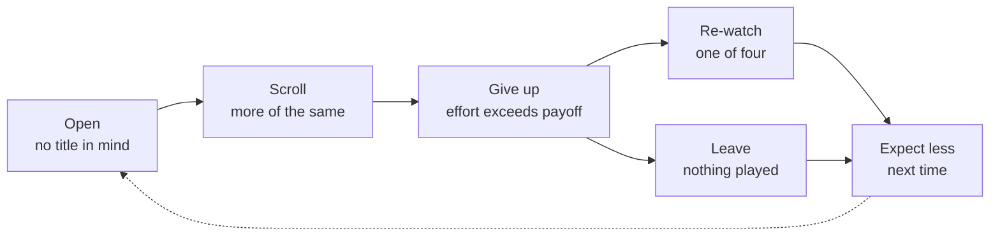
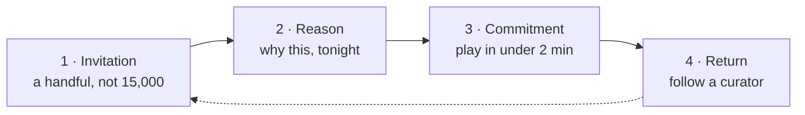

# Future-State Journey Map — StreamLine Spotlight

**Persona:** The Resigned Browser — a regular subscriber who opens StreamLine two or three times a week and has quietly stopped expecting to find anything new.
**Goal:** Start watching something decent within a couple of minutes, without the choosing becoming the evening.
**Friction:** Discovery costs more than the evening is worth, so they abandon the search — falling back to a title they have already seen, or leaving the app entirely.
**Strategy:** Scenario A · Restore & curate — restore brand authority and win back users by prioritizing human-led curation over mass-market scale.

---

## Timeline

**Today** — the loop that ends in a re-watch, or in nothing at all:

A failed decision has two exits, not one. Re-watching is the visible one; closing the app with nothing played is the one that matters more, because it is the mechanism by which a casual browser becomes a wanderer — 1.1 sessions a week, $8.40 per head.

### The emotional curve, and where it dips

| Stage | Touchpoint | Doing | Feeling |
|---|---|---|---|
| Open | Home screen | Opens with no title in mind | **Hopeful** — maybe tonight |
| Scroll | Trending rows, "Because you watched" | Scans rows that return near-duplicates | **Flagging** — seen this, seen this |
| **Give up** | — no touchpoint; the product has stopped helping | Abandons the search | **Resigned** ← **the experience gap** |
| Exit A | Continue Watching row | Re-watches one of four known titles | **Comfortable** — safe, not satisfied |
| Exit B | A second app, or no screen at all | Closes StreamLine with nothing played | **Flat** — the evening moved on |
| Next time | Home screen | Opens again, briefly | **Lowered** — gives it less time |

The dip is at **Give up**, and it is the only stage with no touchpoint at all. That is the gap: at the exact moment the viewer needs the product most, there is nothing there to meet them. Everything Spotlight does is aimed at that one stage.

**With Spotlight** — the loop that ends in a return:

---

## The four stages

Touchpoints across the future state: **home screen → Spotlight rail and its first-run introduction → title detail page → player → next week's selection, reached by rail or digest email.**

### 1. Invitation

- **Touchpoint:** Home screen, first row.
- **User Action:** Opens the app and meets tonight's short Spotlight selection, not the full catalogue.
- **Internal State:** Wary but curious — low expectation, and looking costs almost nothing.
- **Pain Point Addressed:** The twenty-minute scroll never begins; there is no infinite surface to face.
- **Action → Benefit:** Opens the app → meets a handful of picks, not fifteen thousand titles.

### 2. Reason

- **Touchpoint:** The rail card and its first-run introduction.
- **User Action:** Reads a curator's short note on why each title is worth watching tonight.
- **Internal State:** Trust forming — a person made this choice and said why.
- **Pain Point Addressed:** The "Because you watched" loop, which returns near-duplicates and explains nothing.
- **Action → Benefit:** Reads why each was picked → judges in seconds instead of minutes.

### 3. Commitment

- **Touchpoint:** Title detail page, then the player.
- **User Action:** Starts a title they had not heard of, within two minutes of opening the app.
- **Internal State:** Relief — the evening started rather than stalled.
- **Pain Point Addressed:** Effort exceeding payoff, and the fallback to the four comfort titles.
- **Action → Benefit:** Presses play on something new → the evening starts instead of stalling.

### 4. Return

- **Touchpoint:** Next week's rail, or the Spotlight digest email.
- **User Action:** Comes back for the next selection, and follows a curator whose taste fits theirs.
- **Internal State:** Expectation restored — looking is worth doing again.
- **Pain Point Addressed:** The decay loop where each session begins with less hope and less time.
- **Action → Benefit:** Follows a curator → returns for the next pick, not the same show.

---

## Three competitive advantages over the manual workaround

**1. It matches the fallback on speed.** The comfort re-watch wins today because it is instant and never disappoints. A decided, explained pick in under two minutes removes the one advantage that habit has.

**2. It scales what a friend cannot.** A trusted friend gives one recommendation when asked. Spotlight gives a reasoned pick every time the app opens, unprompted, without the user having to ask anyone.

**3. It rebuilds switching cost.** Four known shows are available on any service — that is why this segment swaps. A StreamLine curator whose taste you follow exists only here, and the authority earned is the platform's, not the individual's.

### The unhappy path — where the gap still exists

The four stages above assume the rail lands. It will not always. A viewer can meet Spotlight, scroll past it, and reach the same give-up point as before — and that is the failure our own bad signal is written to catch: high rail impressions with flat card opens.

So the experience gap is not closed by Spotlight, it is **moved**. It now sits after the rail rather than after the trending rows, and it affects fewer people. The map is honest about this rather than ending on a guaranteed success.

What it does not do is add a second surface to catch them. Re-serving the same picks in an interruption fixes nothing — they already declined those once. The intercept worth considering is a different bet entirely: one title, one tap, no choice at all, which is UXR-12's "just tell me what's good tonight" taken literally. It is recorded as **A11 · Play Something** in the roadmap, deliberately not in sprint 1: the week-6 read decides whether prevention was enough.

### A note on the breaking point

The usual move is to find the moment where the cost of inaction outweighs the pain of switching. Here that moment never comes.

The pain is real — they want something new and do not find it. But giving up and re-watching clears it immediately and at no cost, so it never accumulates. Each failed search resets to zero, and the cost of doing nothing stays flat.

Spotlight therefore cannot wait for the current experience to become unbearable. It has to be faster than giving up, which is why Advantage 1 is about matching the fallback on speed rather than solving a worse problem.

---

## How this delivers "Restore & curate"

| Strategy element | Where it lands |
|---|---|
| **Restore brand authority** | Stages 2 and 4. The curators are StreamLine's, and the habit of returning for their next pick rebuilds the platform — not just the individual — as the place you trust for what is worth watching. |
| **Win back users** | Stages 1 and 4. This persona has already churned from discovery while still paying: they open the app and no longer look. The map wins back the viewer who stopped looking, before the subscription follows them out. Cheaper than re-acquisition, and it addresses the 14-point churn gap at its source. |
| **Human-led curation** | Stages 2 and 4, and Advantage 2. A named person makes the choice and says why — the thing the recommendation layer cannot do at any volume. |
| **Restoration** | Stage 2. Curation makes the deep back catalogue usable again: restored and older titles the "Because you watched" layer never surfaces, because nothing in the viewing history points at them. This is what turns fifteen thousand titles from a carrying cost back into an asset. |
| **Over mass-market scale** | Stage 1. The selection is deliberately small and deliberately not personalised to death. Scale is what created the problem; the fix is subtraction. |

---

*Module 2 · Lab 2 · Step 3. Linked from `competitive-and-journey.md`.*
